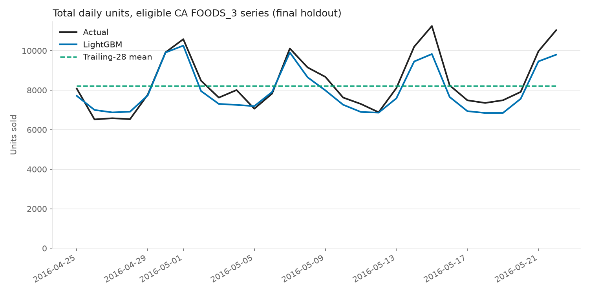
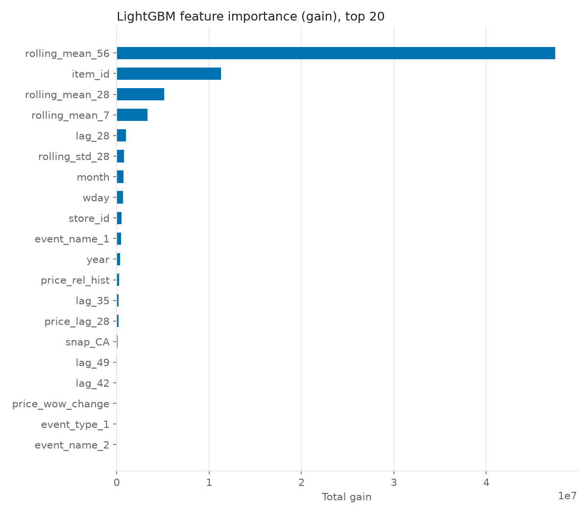
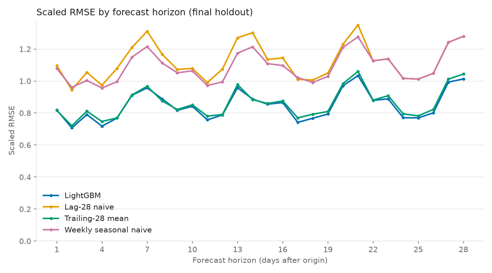

# M5 Retail Demand Forecasting — CA / FOODS_3

A leakage-controlled, walk-forward forecasting experiment on the M5 dataset. It compares a global LightGBM model against three simple retail baselines for 28-day item-store demand.

**Headline (final holdout, d_1914–d_1941, 3,290 series).** LightGBM's mean per-series RMSSE was **0.769**, against **0.778** for the strongest baseline (trailing-28 mean). That is a **1.2% reduction in error**: a small margin, consistent with the near-tie seen in validation. LightGBM is clearly better than lag-28 (−25.8% error) and weekly seasonal naive (−22.7% error).

---

## 1. Business Problem

Can a machine-learning model forecast the next 28 days of item-store demand better than simple retail forecasting baselines?

This is an **offline historical backtest**, not a production forecasting system.

## 2. Dataset

[M5 Forecasting — Accuracy](https://www.kaggle.com/competitions/m5-forecasting-accuracy) (Walmart unit sales, 2011-01-29 to 2016-05-22). The project uses:

- `sales_train_evaluation.csv`: 30,490 item-store series, d_1–d_1941;
- `calendar.csv`: 1,969 days, with events and SNAP flags;
- `sell_prices.csv`: 6,841,121 weekly price rows.

The files are downloaded manually into `data/raw/` and are never committed.

## 3. Scope

- California (stores CA_1–CA_4), department FOODS_3: **823 items × 4 stores = 3,292 item-store series**.
- Filtered while the sales table is still wide, then melted to long `series × day` rows.
- Modelling targets from **d_1000** onward. Days d_900–d_999 are a feature warm-up buffer only.
- The RMSSE scale uses each series' full history from d_1.

## 4. Forecasting Setup

- At a forecast origin `O`, a single **direct** forecast is produced for all 28 days `O+1 … O+28`. There is no recursion.
- One **global** LightGBM model is trained across all item-store series. It is not one model per series.

## 5. Information Boundary / Leakage Prevention

- **Sales features.** For target day `t`, every sales-derived feature uses only sales on or before `t − 28`.
  - Rolling statistics are computed *after* a 28-day shift.
  - Days before a series' launch (its first priced week) are treated as missing, not as zero demand.
- **Price features.** These use only weekly prices from weeks that **fully ended on or before `t − 28`**.
  - M5 prices are weekly, so this makes price information 28–34 days old.
  - Forward-fill is chronological only. There is no back-fill and no "price missing / future availability" feature.
- **Calendar features.** Target-date calendar variables (weekday, month, year, events, SNAP) are treated as known in advance.
- **RMSSE scale.** Computed per fold from training history only, ending at the origin.
- **Holdout protection.**
  - Holdout sales are hidden from the default data loader.
  - The holdout command requires `--run-holdout` and refuses to overwrite an existing result.
  - The holdout was run once.
- **Tests.** 39 automated tests cover these rules, mostly with synthetic data designed so that a leak would change the answer. Before the holdout run, a real-data check corrupted every sale and price after `t − 28` and confirmed that the holdout features did not change.

**This is a deliberate modelling choice.** Real retailers often *do* know planned future prices and promotions. This project chose not to use M5's future-period prices.

## 6. Baselines

All three baselines were frozen before LightGBM tuning.

| Baseline | Forecast for day `O+h` |
|---|---|
| Lag-28 seasonal naive | actual sales on day `O+h−28` |
| Trailing-28 mean | mean of the last 28 days through `O`, flat for all 28 days |
| Weekly seasonal naive | the last 7 known days (`O−6 … O`) repeated four times |

## 7. Feature Engineering

21 features:

- **Sales (8):** `lag_28/35/42/49`, `rolling_mean_7/28/56`, `rolling_std_28`. All rolling statistics are computed on sales shifted by 28 days.
- **Price (3):** `price_lag_28` (last fully known weekly price), `price_wow_change` (lagged week-over-week change), and `price_rel_hist`. The last one is the price relative to the series' expanding mean of *observed* historical prices.
- **Calendar (8):** `wday`, `month`, `year`, `event_name_1/2`, `event_type_1/2`, `snap_CA`.
- **Identity (2):** `item_id` and `store_id`, as categoricals.

## 8. Model

- LightGBM with `objective="tweedie"` and `tweedie_variance_power=1.5`.
- Tweedie suits demand that is often exactly zero and otherwise positive and skewed. It is treated as a modelling choice to be tested, not as inherently superior.
- Fixed seed (42), deterministic mode, fixed boosting rounds, and no early stopping.

## 9. Walk-Forward Validation

Expanding-window walk-forward:

| Fold | Origin | Evaluated days | Training rows | Eligible series |
|---|---|---|---|---|
| 1 | d_1829 | d_1830–d_1857 | 2,586,174 | 3,287 |
| 2 | d_1857 | d_1858–d_1885 | 2,678,328 | 3,287 |
| 3 | d_1885 | d_1886–d_1913 | 2,770,504 | 3,287 |
| **Final holdout** | d_1913 | d_1914–d_1941 | 2,862,680 | 3,290 |

**Eligibility** is decided per fold, using only information available at the origin. A series needs:

- a completed first priced week;
- at least 84 active days;
- a valid RMSSE scale: at least 28 one-step differences from its first sale, with `q > 0`.

Every model is scored on exactly the same eligible series.

| Period | Candidates | Not yet active | Insufficient history | Invalid scale | Eligible |
|---|---|---|---|---|---|
| Fold 1 | 3,292 | 3 | 2 | 0 | 3,287 |
| Fold 2 | 3,292 | 0 | 5 | 0 | 3,287 |
| Fold 3 | 3,292 | 0 | 5 | 0 | 3,287 |
| Holdout | 3,292 | 0 | 2 | 0 | 3,290 |

**Validation results** (mean per-series RMSSE). These were used for model selection *only*.

| Model | Fold 1 | Fold 2 | Fold 3 | Average |
|---|---|---|---|---|
| Lag-28 | 0.9355 | 0.9996 | 1.0177 | 0.9843 |
| Weekly seasonal naive | 0.9049 | 0.9633 | 0.9867 | 0.9517 |
| Trailing-28 mean | 0.7127 | 0.7564 | 0.7712 | 0.7468 |
| LightGBM A (31 leaves, lr 0.05, 300 rounds) | 0.7167 | 0.7587 | 0.7693 | 0.7482 |
| **LightGBM B (63 leaves, lr 0.05, 300 rounds)** | 0.7140 | 0.7579 | 0.7650 | **0.7456** |
| LightGBM C (31 leaves, lr 0.03, 500 rounds) | 0.7164 | 0.7592 | 0.7688 | 0.7481 |

- **Config B was selected.** The three configurations differ by ≤ 0.0026, roughly ten times less than the fold-to-fold standard deviation (≈ 0.028). The choice between them is effectively a tie.
- **In validation, B essentially tied trailing-28.** It was slightly worse in folds 1–2 and 0.8% better in fold 3. The average error reduction was 0.2%.

## 10. Metrics

- **MAE** and **RMSE** are pooled over every eligible series × forecast day, in units sold.
- **RMSSE** is computed **per series** as `sqrt(MSE_i / q_i)`, where `q_i` is the mean squared one-step change of that series' own training history (from its first sale to the origin). It is then summarized across series:
  - **mean** (the primary selection metric);
  - median, 95th percentile, and maximum (diagnostics).
- This is **not** the official hierarchical M5 WRMSSE. There is no revenue weighting and no aggregation levels.
- MAPE is not used: it is undefined on zero-sales days.
- Improvement is `(baseline − model) / baseline × 100`, and refers to a *reduction in error*.

## 11. Holdout Results

Final holdout: origin d_1913, days d_1914–d_1941, 3,290 eligible series. Config B was frozen from validation. This was a single run.

| Model | MAE | RMSE | Mean RMSSE | Median RMSSE | p95 RMSSE | Max RMSSE |
|---|---|---|---|---|---|---|
| Lag-28 seasonal naive | 1.9472 | 3.7840 | 1.0373 | 0.9814 | 1.7985 | 6.3287 |
| Weekly seasonal naive | 1.8595 | 3.4498 | 0.9960 | 0.9348 | 1.7567 | 6.1917 |
| Trailing-28 mean | 1.5989 | 3.0532 | 0.7784 | 0.7155 | 1.4330 | 6.3142 |
| **LightGBM (config B)** | **1.5570** | **2.8918** | **0.7694** | **0.7014** | **1.4019** | 6.2564 |

**LightGBM's change in mean RMSSE against each baseline:**

| Baseline | Change in error |
|---|---|
| Lag-28 | 25.8% lower |
| Weekly seasonal naive | 22.7% lower |
| Trailing-28 mean | 1.2% lower |

**Interpretation**

- Against the two naive baselines, the improvement is large and consistent with validation.
- Against trailing-28 mean, LightGBM is ahead on every summary statistic, but the margin is small (1.2%). In validation the two were essentially tied (average 0.2%, range −0.2% to +0.8% across folds). This result should be read as *modestly better than a strong simple baseline*, not as a decisive win.
- At the series level, LightGBM had lower RMSSE than trailing-28 on 57.8% of series.
- **Aggregate bias:** actual holdout units were 233,777 and LightGBM predicted 223,565, an **under-forecast of 4.4%**. Validation showed the same tendency (−11%, −5%, −2%).

## 12. Forecast Chart



Total daily units across the 3,290 eligible series:

- LightGBM follows the weekly shape (weekend peaks) that a flat trailing mean cannot.
- It under-predicts the peaks in the second half of the window.

## 13. Feature Importance



**Gain is dominated by `rolling_mean_56`**, followed by `item_id`, the shorter rolling means, `lag_28`, `rolling_std_28`, `month` and `wday`.

- **Price features rank low.** This is plausible given they are at least 28 days old relative to each target day.
- **The ranking matches validation.** The top five are identical to the validation model (fold 3), and the remaining ranks barely move.
- **No leakage-like feature appears.**
- **`item_id` has by far the most splits.** That is expected for an 823-level identifier carrying item-level demand, but it is a capacity/overfitting consideration.

## 14. Forecast-Horizon Analysis



Scaled RMSE by forecast horizon, for h = 1…28 (`results/scaled_rmse_by_horizon.csv`):

- **LightGBM vs trailing-28.** The two track each other closely at every horizon. LightGBM is lower on most days; trailing-28 is marginally lower at h = 1, 8 and 14.
- **Naive baselines.** Both are much worse throughout. For h = 22–28 they are *identical by construction*, because both forecast from days `O−6 … O`.
- **Peaks.** The error peaks repeat every 7 days, on weekend days. The repeating seven-day error pattern suggests weekday/weekend seasonality contributes more to variation than forecast distance alone.

Averaging these 28 values does **not** equal the headline mean per-series RMSSE, because the two aggregate in a different order.

**Example series** (chosen by rule, not by eye: among series averaging at least 1 unit/day in the holdout, the extreme and middle values of LightGBM RMSSE ÷ best baseline RMSSE):

- **Clear LightGBM win — `FOODS_3_236_CA_3`.** RMSSE 0.53 vs 0.92 for the best baseline.
  - The series rose from ≈ 0/day (d_1830–d_1857) to ≈ 7.9/day just before the origin, then sold ≈ 4.7/day in the holdout.
  - Trailing-28 projected 7.9/day.
  - LightGBM, leaning on longer windows and item-level patterns, predicted ≈ 3.9/day.
  - This win comes partly from *shrinking toward longer history* when a recent surge did not persist, not from foresight.
- **Roughly equal — `FOODS_3_750_CA_4`.** A sparse, low-volume series (≈ 1.3/day, many zero days).
  - Both models predict ≈ 1.2–1.3/day.
  - There is little signal to exploit beyond the level.
- **Clear LightGBM loss — `FOODS_3_746_CA_3`.** RMSSE 1.87 vs 0.57 for weekly naive.
  - Demand fell from ≈ 15/day to ≈ 6/day in the final week before the origin, then averaged ≈ 4.8/day in the holdout.
  - For much of the 28-day horizon, LightGBM could not use the sharp demand drop immediately before the forecast origin, because sales-derived features were constrained to `t − 28`. It predicted ≈ 14/day on average.
  - Only the final horizon days (h ≈ 22–28) could reach into that last pre-origin week, and even then mainly through lag and rolling features that also averaged the older, higher sales.
  - The weekly-naive baseline could use the final observed week directly.
  - This is the direct cost of the 28-day information boundary.

**Extreme series.** The largest RMSSEs are shared by every model.

- `FOODS_3_444_CA_2` sold nothing for 332 days before the origin, then sold ≈ 7/day.
- `FOODS_3_381_CA_2` jumped from ≈ 1/day to ≈ 7/day.

Neither is forecastable from history under this information set. They were not clipped or removed.

## 15. Limitations

- **Scope:** only CA / FOODS_3. The results may not generalise to other states or categories.
- **Backtest only:** an offline historical backtest, not a deployed system.
- **Metric:** no full official hierarchical M5 WRMSSE. Metrics are a project-specific per-series RMSSE.
- **Point forecasts only:** no probabilistic intervals, so safety-stock decisions are not supported.
- **Restricted information:**
  - Sales and price information is at least 28 days old relative to each target day.
  - Future planned prices and promotions are not used.
  - Stockouts are not modelled: zero sales are treated as genuine demand.
- **Limited tuning:** only three predefined configurations. Their differences were within fold-to-fold noise.
- **Small margin over trailing-28:** the 1.2% holdout improvement over the strongest baseline is small relative to the validation variability.

## 16. What I Would Do Next

1. **Add known-ahead planned-price and promotion features supplied by the retailer at the forecast origin.** Real retailers often know future planned prices and promotions. This project intentionally adopted a simple 28-day historical information boundary instead.
2. **Use fresher sales information for early horizons.** Options are horizon-specific direct models, or a recursive/hybrid approach. This targets the failure seen in `FOODS_3_746_CA_3`.
3. **Make the forecasts usable for inventory decisions:**
   - address the systematic under-forecast by evaluating calibration or bias-correction methods on the validation folds before applying them to a future holdout (never calibrating against results already inspected);
   - add probabilistic (quantile) forecasts.
4. **Detect likely stockouts** and treat stockout-driven zeros differently from genuine zero demand.
5. **Extend to all states and departments** and implement the full hierarchical WRMSSE.

## 17. How to Run

```bash
python -m venv .venv
.venv\Scripts\activate            # Windows; use `source .venv/bin/activate` elsewhere
pip install -r requirements.txt
pytest                            # 39 tests
python -m src.run inspect         # schema checks + raw data summary
python -m src.run preprocess      # Parquet caches in data/processed/
python -m src.run baselines       # results/baseline_metrics.csv, fold_eligibility.csv
python -m src.run validate --rounds 100 --folds 1   # smoke test
python -m src.run tune            # 9 fits -> tuning_results.csv, best_config.json
python -m src.run holdout --run-holdout             # final holdout (refuses to overwrite)
```

Developed with Python 3.12.

## 18. Key Design Decisions

### Why use a 28-day information boundary?

- The project produces all 28 forecast days at once. To keep every target leakage-safe under the same rule, sales- and price-derived features for target day t use information no later than t − 28.
- This is deliberately conservative. It means the model cannot use the most recent sales observations for early forecast horizons, but it makes the information boundary simple, reproducible, and easy to audit.

### Why only use price weeks that have fully ended?

- M5 prices are weekly rather than daily. A week containing t − 28 may include days later than the permitted cutoff.
- The project therefore only uses a weekly price once the entire week has ended on or before t − 28. As a result, price information is effectively about 28–34 days old.
- A real retailer may know planned future prices and promotions in advance; adding those known-ahead variables would be a logical next step.

### Why are active start and RMSSE scaling start different?

- They answer different questions.
- Active start is based on the first completed week in which an item-store series has a price. It determines when the product is treated as launched and is used for training-history and eligibility rules.
- RMSSE scaling start begins at the first non-zero sale. It determines the historical variability against which forecast error is scaled.
- Keeping the two definitions separate avoids treating pre-launch zeros as genuine demand while preserving the intended interpretation of RMSSE.

### Why use per-series RMSSE as the primary metric but pooled MAE and RMSE as secondary metrics?

- Products sell at very different volumes. Raw RMSE from a high-volume item cannot be compared directly with RMSE from a low-volume item.
- RMSSE scales each series' error using that series' own historical one-step variation, allowing performance to be compared across thousands of item-store series. Mean per-series RMSSE is therefore the primary model-selection metric.
- MAE and RMSE are also reported by pooling all eligible item-store-day predictions. They remain useful because they express error directly in units sold.

### Why is the trailing-28 mean hard to beat?

- Retail demand contains substantial short-term level information. Averaging the final 28 observed days gives the baseline access to very recent demand immediately before the forecast origin.
- The LightGBM model deliberately does not have equally recent sales-derived features because of the 28-day information boundary. This makes trailing-28 a strong benchmark rather than a deliberately weak baseline.
- On the final holdout, LightGBM reduced mean RMSSE by only 1.2% relative to trailing-28, despite beating lag-28 by 25.8% and weekly seasonal naive by 22.7%. The result shows why sophisticated models should be tested against strong simple alternatives rather than assumed to be better.

### Why was the final holdout evaluated only once?

- The three walk-forward validation folds were used for model comparison and configuration selection. The final period, d_1914–d_1941, was kept untouched until the model configuration, features, baselines, eligibility rules, and metrics were frozen.
- The holdout was then evaluated once.
- No model or feature changes were made after seeing its results. This preserves the holdout as a genuine estimate of performance on unseen future data rather than another tuning set.
